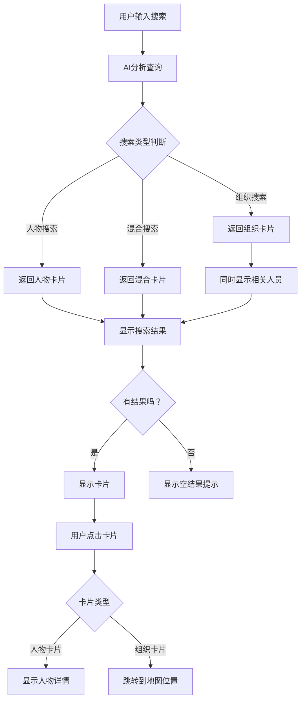

# AI卡片式搜索系统产品需求文档

## 1. 产品概述

重新设计CoderLink的AI搜索功能，从传统的文字回复模式升级为直观的卡片式展示系统。用户搜索时将直接看到人物卡片和组织卡片，提供更好的视觉体验和交互效果。

- 解决问题：当前AI搜索返回大段文字，用户需要阅读才能获取关键信息，效率较低
- 目标用户：所有使用CoderLink进行联系人管理和搜索的用户
- 产品价值：提升搜索体验，增强信息可视化，提高用户操作效率

## 2. 核心功能

### 2.1 用户角色
本功能不需要区分用户角色，所有用户均可使用卡片式搜索功能。

### 2.2 功能模块

我们的AI卡片式搜索系统包含以下主要功能：

1. **人物卡片搜索**：AI搜索返回人物卡片，无文字描述
2. **组织卡片搜索**：搜索组织时显示组织卡片和相关人员
3. **地图跳转功能**：点击组织卡片可跳转到地图相关位置
4. **空结果处理**：未找到相关内容时显示友好提示

### 2.3 页面详情

| 页面名称 | 模块名称 | 功能描述 |
|----------|----------|----------|
| 主页面 | AI搜索栏 | 接收用户搜索查询，触发AI搜索功能 |
| 主页面 | 人物卡片展示区 | 显示搜索到的人物卡片，包含头像、姓名、职位、公司等信息 |
| 主页面 | 组织卡片展示区 | 显示搜索到的组织卡片，包含组织名称、类型、描述等信息 |
| 主页面 | 相关人员展示区 | 搜索组织时同时显示该组织的相关人员卡片 |
| 主页面 | 空结果提示 | 未找到相关内容时显示"没有找到相关的人"或"没有找到相关的组织" |
| 地图页面 | 组织位置标记 | 点击组织卡片后跳转到地图上的相关位置 |

## 3. 核心流程

**用户搜索流程：**
1. 用户在搜索栏输入查询内容
2. AI分析查询内容，判断搜索类型（人物/组织/混合）
3. 系统返回对应的卡片结果
4. 用户可点击卡片查看详情或跳转到地图

**组织搜索特殊流程：**
1. 用户搜索组织相关内容
2. 系统返回匹配的组织卡片
3. 同时显示该组织的相关人员卡片
4. 用户可点击组织卡片跳转到地图位置



## 4. 用户界面设计

### 4.1 设计风格

- **主色调**：保持现有的紫色主题（#7B68EE），辅助色为浅灰色（#F5F5F5）
- **卡片样式**：圆角矩形卡片，带有轻微阴影效果，悬停时有微动画
- **字体**：主标题使用16px粗体，副标题使用14px常规，描述文字使用12px
- **布局风格**：响应式网格布局，卡片自适应排列
- **图标风格**：使用Bootstrap Icons，简洁现代的线性图标

### 4.2 页面设计概览

| 页面名称 | 模块名称 | UI元素 |
|----------|----------|--------|
| 主页面 | 搜索结果区域 | 网格布局，每行最多3个卡片，卡片间距16px，背景色#FFFFFF，圆角8px，阴影0 2px 8px rgba(0,0,0,0.1) |
| 主页面 | 人物卡片 | 头像（48px圆形），姓名（16px粗体），职位（14px），公司（12px灰色），标签（小号彩色标签） |
| 主页面 | 组织卡片 | 组织图标（48px），组织名称（16px粗体），类型标签（14px），描述（12px灰色），地图跳转按钮 |
| 主页面 | 空结果提示 | 居中显示，图标+文字，颜色#666666，字体14px |

### 4.3 响应式设计

- **桌面端优先**：主要针对桌面端设计，卡片网格布局
- **移动端适配**：移动端改为单列布局，卡片宽度100%
- **触摸优化**：移动端卡片点击区域增大，支持触摸手势

## 5. 技术实现要求

### 5.1 前端实现

- 修改AI搜索结果展示组件，支持卡片式布局
- 实现人物卡片和组织卡片的UI组件
- 添加地图跳转功能的JavaScript逻辑
- 优化搜索结果的动画效果

### 5.2 后端API调整

- 修改AI搜索接口，返回结构化的卡片数据
- 增加搜索类型识别逻辑
- 优化组织搜索时的相关人员查询
- 添加地图位置信息到组织数据

### 5.3 数据结构设计

**人物卡片数据结构：**
```json
{
  "type": "person",
  "id": "person_id",
  "name": "姓名",
  "avatar": "头像URL",
  "title": "职位",
  "company": "公司名称",
  "tags": ["标签1", "标签2"],
  "contact": {
    "email": "邮箱",
    "phone": "电话"
  }
}
```

**组织卡片数据结构：**
```json
{
  "type": "organization",
  "id": "org_id",
  "name": "组织名称",
  "icon": "图标URL",
  "category": "组织类型",
  "description": "组织描述",
  "location": {
    "lat": 纬度,
    "lng": 经度,
    "address": "地址"
  },
  "relatedPersons": [人物卡片数组]
}
```