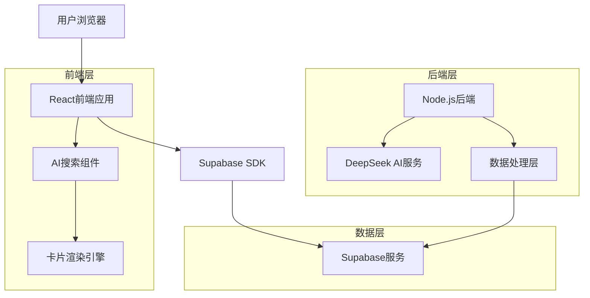
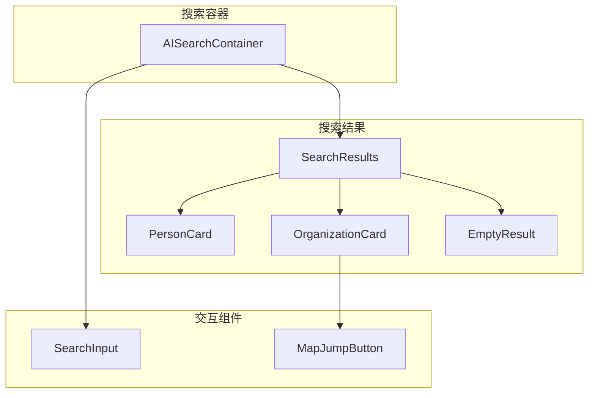
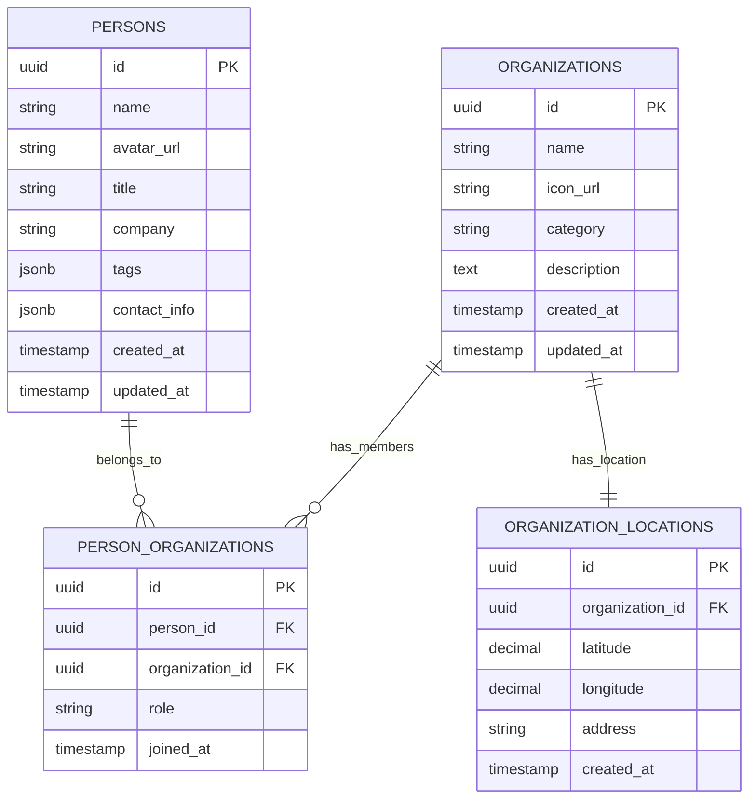

# AI卡片式搜索系统技术架构文档

## 1. 架构设计



## 2. 技术描述

- 前端：React@18 + tailwindcss@3 + vite
- 后端：Node.js + Express + DeepSeek AI API
- 数据库：Supabase (PostgreSQL)
- 地图服务：集成现有地图组件

## 3. 路由定义

| 路由 | 用途 |
|------|------|
| /api/ai/card-search | AI卡片式搜索接口，返回结构化卡片数据 |
| /api/organizations/map-location/:id | 获取组织的地图位置信息 |
| /api/persons/by-organization/:orgId | 获取组织相关的人员列表 |

## 4. API定义

### 4.1 核心API

**AI卡片搜索接口**
```
POST /api/ai/card-search
```

请求参数：
| 参数名 | 参数类型 | 是否必需 | 描述 |
|--------|----------|----------|------|
| query | string | true | 用户搜索查询内容 |
| searchType | string | false | 搜索类型：person/organization/auto |
| limit | number | false | 返回结果数量限制，默认10 |

响应数据：
| 字段名 | 字段类型 | 描述 |
|--------|----------|------|
| success | boolean | 请求是否成功 |
| data | object | 搜索结果数据 |
| data.type | string | 搜索结果类型：person/organization/mixed/empty |
| data.persons | array | 人物卡片数组 |
| data.organizations | array | 组织卡片数组 |
| data.message | string | 空结果时的提示信息 |

请求示例：
```json
{
  "query": "周周黑客松的独立开发者",
  "searchType": "auto",
  "limit": 10
}
```

响应示例：
```json
{
  "success": true,
  "data": {
    "type": "mixed",
    "persons": [
      {
        "type": "person",
        "id": "p001",
        "name": "张三",
        "avatar": "/icon/zhangsan.jpg",
        "title": "独立开发者",
        "company": "自由职业",
        "tags": ["React", "Node.js"],
        "contact": {
          "email": "zhangsan@example.com"
        }
      }
    ],
    "organizations": [
      {
        "type": "organization",
        "id": "o001",
        "name": "周周黑客松",
        "icon": "/icon/hackathon.png",
        "category": "技术社区",
        "description": "每周举办的黑客松活动",
        "location": {
          "lat": 39.9042,
          "lng": 116.4074,
          "address": "北京市朝阳区"
        },
        "relatedPersons": []
      }
    ]
  }
}
```

**组织地图位置接口**
```
GET /api/organizations/map-location/:id
```

响应数据：
```json
{
  "success": true,
  "data": {
    "id": "o001",
    "name": "组织名称",
    "location": {
      "lat": 39.9042,
      "lng": 116.4074,
      "address": "详细地址"
    }
  }
}
```

## 5. 前端组件架构



### 5.1 组件设计规范

**PersonCard组件**
```jsx
const PersonCard = ({ person, onClick }) => {
  return (
    <div className="person-card" onClick={() => onClick(person)}>
      
      <div className="info">
        <h3 className="name">{person.name}</h3>
        <p className="title">{person.title}</p>
        <p className="company">{person.company}</p>
        <div className="tags">
          {person.tags.map(tag => (
            <span key={tag} className="tag">{tag}</span>
          ))}
        </div>
      </div>
    </div>
  );
};
```

**OrganizationCard组件**
```jsx
const OrganizationCard = ({ organization, onMapJump }) => {
  return (
    <div className="organization-card">
      
      <div className="info">
        <h3 className="name">{organization.name}</h3>
        <span className="category">{organization.category}</span>
        <p className="description">{organization.description}</p>
        <button 
          className="map-jump-btn"
          onClick={() => onMapJump(organization.location)}
        >
          📍 查看位置
        </button>
      </div>
      {organization.relatedPersons.length > 0 && (
        <div className="related-persons">
          <h4>相关人员</h4>
          <div className="persons-grid">
            {organization.relatedPersons.map(person => (
              <PersonCard key={person.id} person={person} />
            ))}
          </div>
        </div>
      )}
    </div>
  );
};
```

## 6. 数据模型

### 6.1 数据模型定义



### 6.2 数据定义语言

**组织位置表 (organization_locations)**
```sql
-- 创建组织位置表
CREATE TABLE organization_locations (
    id UUID PRIMARY KEY DEFAULT gen_random_uuid(),
    organization_id UUID NOT NULL,
    latitude DECIMAL(10, 8),
    longitude DECIMAL(11, 8),
    address TEXT,
    created_at TIMESTAMP WITH TIME ZONE DEFAULT NOW(),
    FOREIGN KEY (organization_id) REFERENCES organizations(id) ON DELETE CASCADE
);

-- 创建索引
CREATE INDEX idx_organization_locations_org_id ON organization_locations(organization_id);
CREATE INDEX idx_organization_locations_coords ON organization_locations(latitude, longitude);

-- 权限设置
GRANT SELECT ON organization_locations TO anon;
GRANT ALL PRIVILEGES ON organization_locations TO authenticated;

-- 初始化数据
INSERT INTO organization_locations (organization_id, latitude, longitude, address)
SELECT 
    o.id,
    39.9042 + (RANDOM() - 0.5) * 0.1,  -- 北京周边随机坐标
    116.4074 + (RANDOM() - 0.5) * 0.1,
    '北京市朝阳区示例地址' || o.name
FROM organizations o
WHERE NOT EXISTS (
    SELECT 1 FROM organization_locations ol WHERE ol.organization_id = o.id
);
```

**人员组织关系表 (person_organizations)**
```sql
-- 创建人员组织关系表
CREATE TABLE person_organizations (
    id UUID PRIMARY KEY DEFAULT gen_random_uuid(),
    person_id UUID NOT NULL,
    organization_id UUID NOT NULL,
    role VARCHAR(100),
    joined_at TIMESTAMP WITH TIME ZONE DEFAULT NOW(),
    FOREIGN KEY (person_id) REFERENCES persons(id) ON DELETE CASCADE,
    FOREIGN KEY (organization_id) REFERENCES organizations(id) ON DELETE CASCADE,
    UNIQUE(person_id, organization_id)
);

-- 创建索引
CREATE INDEX idx_person_organizations_person_id ON person_organizations(person_id);
CREATE INDEX idx_person_organizations_org_id ON person_organizations(organization_id);

-- 权限设置
GRANT SELECT ON person_organizations TO anon;
GRANT ALL PRIVILEGES ON person_organizations TO authenticated;
```

## 7. AI搜索逻辑优化

### 7.1 搜索类型识别

```javascript
class SearchTypeClassifier {
  static classifyQuery(query) {
    const personKeywords = ['人', '开发者', '工程师', '设计师', '产品经理'];
    const orgKeywords = ['公司', '组织', '团队', '社区', '机构'];
    
    const hasPersonKeywords = personKeywords.some(keyword => 
      query.includes(keyword)
    );
    const hasOrgKeywords = orgKeywords.some(keyword => 
      query.includes(keyword)
    );
    
    if (hasPersonKeywords && !hasOrgKeywords) return 'person';
    if (hasOrgKeywords && !hasPersonKeywords) return 'organization';
    return 'mixed';
  }
}
```

### 7.2 结果格式化

```javascript
class SearchResultFormatter {
  static formatPersonCard(person) {
    return {
      type: 'person',
      id: person.id,
      name: person.name,
      avatar: person.avatar_url || '/icon/common.png',
      title: person.title || '未知职位',
      company: person.company || '未知公司',
      tags: person.tags || [],
      contact: {
        email: person.email,
        phone: person.phone
      }
    };
  }
  
  static formatOrganizationCard(org, relatedPersons = []) {
    return {
      type: 'organization',
      id: org.id,
      name: org.name,
      icon: org.icon_url || '/icon/common.png',
      category: org.category || '未分类',
      description: org.description || '',
      location: org.location || null,
      relatedPersons: relatedPersons.map(this.formatPersonCard)
    };
  }
}
```