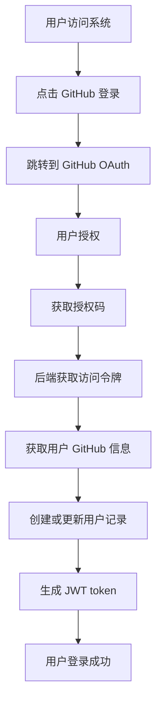
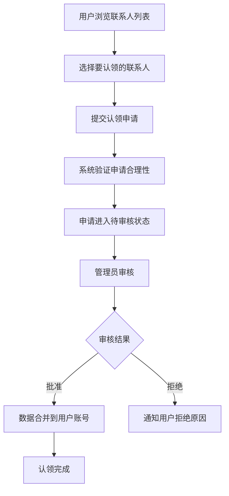
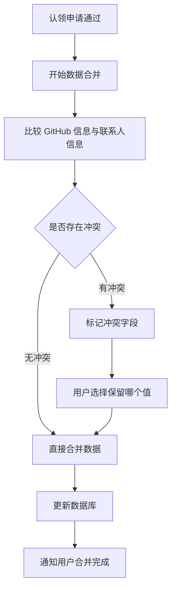
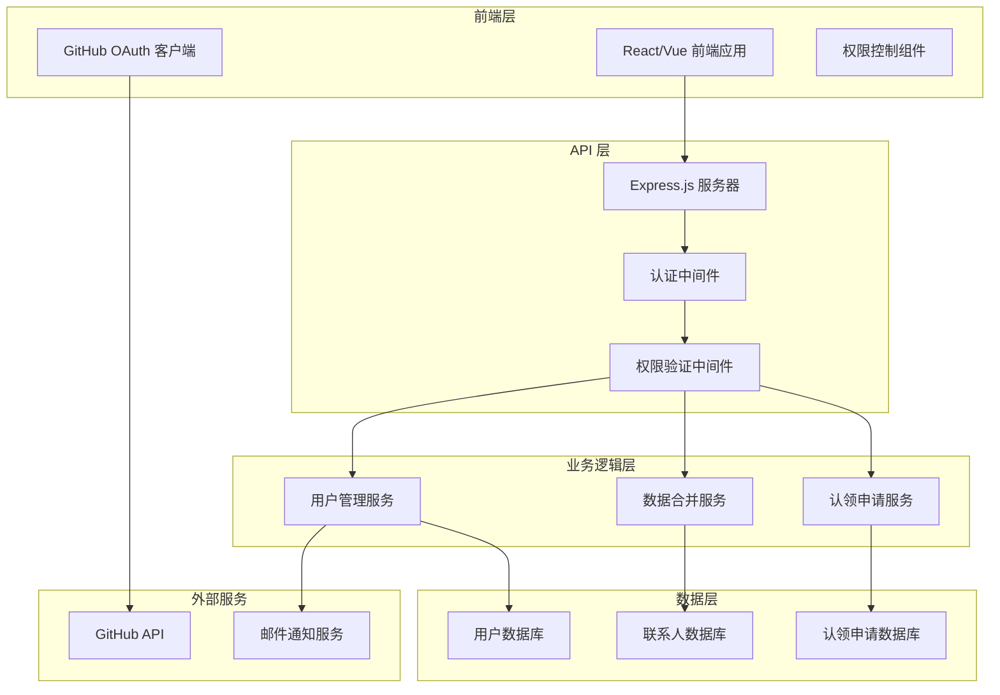

# CoderLink 多用户权限管理系统需求文档

## 1. 产品概述

CoderLink 多用户权限管理系统是一个基于 GitHub OAuth 的用户认证和权限控制系统，允许用户通过 GitHub 账号登录，管理自己的联系人信息，并通过认领机制将现有的联系人数据与自己的账号关联。

**核心目标：**
- 实现基于 GitHub 的用户身份认证
- 确保用户只能编辑自己的信息，保护数据安全
- 提供认领机制，让用户可以声明现有联系人信息的所有权
- 建立后台审核流程，确保认领的合理性
- 实现数据合并功能，将认领的信息整合到用户的 GitHub 档案中

## 2. 核心特性

### 2.1 用户角色

| 角色 | 注册方式 | 核心权限 |
|------|----------|----------|
| 游客用户 | 无需注册 | 只能浏览公开信息，无法编辑任何内容 |
| 认证用户 | GitHub OAuth 登录 | 可以编辑自己的信息，认领现有联系人，查看完整网络图谱 |
| 管理员 | 系统指定 | 审核认领申请，管理用户权限，处理争议 |

### 2.2 功能模块

我们的多用户权限管理系统包含以下核心页面：

1. **登录页面**：GitHub OAuth 认证入口，用户身份验证
2. **个人档案页面**：显示和编辑用户的 GitHub 信息和关联的联系人数据
3. **认领申请页面**：用户可以浏览和申请认领现有的联系人信息
4. **管理后台页面**：管理员审核认领申请，处理用户权限
5. **权限控制页面**：显示用户权限状态，处理权限相关操作
6. **数据合并页面**：展示认领成功后的数据合并结果
7. **审核历史页面**：显示用户的认领历史和审核状态

### 2.3 页面详情

| 页面名称 | 模块名称 | 功能描述 |
|----------|----------|----------|
| 登录页面 | GitHub OAuth 认证 | 集成 GitHub OAuth 2.0，获取用户基本信息和公开仓库信息 |
| 登录页面 | 用户信息获取 | 自动获取 GitHub 用户名、头像、邮箱、公司等信息 |
| 登录页面 | 会话管理 | 生成 JWT token，管理用户登录状态 |
| 个人档案页面 | 个人信息展示 | 显示用户的 GitHub 信息和已认领的联系人数据 |
| 个人档案页面 | 信息编辑 | 允许用户编辑自己的联系人信息，包括标签、关系等 |
| 个人档案页面 | 权限验证 | 确保用户只能编辑属于自己的信息 |
| 认领申请页面 | 联系人浏览 | 显示所有未被认领的联系人信息 |
| 认领申请页面 | 认领申请 | 用户可以申请认领与自己相关的联系人信息 |
| 认领申请页面 | 申请状态跟踪 | 显示认领申请的审核状态和进度 |
| 管理后台页面 | 申请审核 | 管理员审核用户的认领申请，批准或拒绝 |
| 管理后台页面 | 用户管理 | 管理用户权限，处理账号相关问题 |
| 管理后台页面 | 争议处理 | 处理多人认领同一联系人的争议情况 |
| 权限控制页面 | 权限展示 | 显示当前用户的权限范围和限制 |
| 权限控制页面 | 访问控制 | 实时验证用户对特定资源的访问权限 |
| 数据合并页面 | 信息整合 | 将认领成功的联系人信息合并到用户的 GitHub 档案 |
| 数据合并页面 | 冲突解决 | 处理数据合并时的信息冲突和重复 |
| 审核历史页面 | 历史记录 | 显示用户所有的认领申请历史 |
| 审核历史页面 | 状态查询 | 查询特定申请的详细审核过程和结果 |

## 3. 核心流程

### 用户认证流程


### 认领申请流程


### 数据合并流程


## 4. 用户界面设计

### 4.1 设计风格
- **主色调**：GitHub 风格的黑白灰配色方案（#24292e, #ffffff, #f6f8fa）
- **辅助色**：GitHub 绿色（#28a745）用于成功状态，红色（#dc3545）用于错误状态
- **按钮样式**：圆角矩形按钮，与 GitHub 界面风格保持一致
- **字体**：系统默认字体栈，确保在不同平台的一致性
- **布局风格**：卡片式布局，清晰的信息层次
- **图标风格**：使用 GitHub Octicons 图标集，保持视觉一致性

### 4.2 页面设计概览

| 页面名称 | 模块名称 | UI 元素 |
|----------|----------|----------|
| 登录页面 | GitHub OAuth 按钮 | 大型绿色按钮，GitHub 图标，"使用 GitHub 登录" 文字 |
| 登录页面 | 系统介绍 | 简洁的产品介绍文字，突出多用户协作特性 |
| 个人档案页面 | 用户信息卡片 | 头像、用户名、邮箱、公司信息，GitHub 链接 |
| 个人档案页面 | 已认领联系人列表 | 卡片式布局，显示认领的联系人信息和关系 |
| 认领申请页面 | 联系人网格 | 网格布局展示可认领的联系人，包含头像和基本信息 |
| 认领申请页面 | 认领按钮 | 每个联系人卡片上的"认领"按钮，点击后弹出确认对话框 |
| 管理后台页面 | 申请列表 | 表格形式显示待审核申请，包含申请人、目标联系人、申请时间 |
| 管理后台页面 | 审核操作 | 批准/拒绝按钮，备注输入框，批量操作选项 |

### 4.3 响应式设计
- **桌面优先**：主要针对桌面端设计，确保管理功能的易用性
- **移动端适配**：关键功能在移动端可用，但管理后台建议在桌面端使用
- **触摸优化**：按钮和交互元素适合触摸操作，最小点击区域 44px

## 5. 技术架构

### 5.1 系统架构图


### 5.2 数据库设计

#### 用户表 (users)
```sql
CREATE TABLE users (
    id VARCHAR(36) PRIMARY KEY,
    github_id VARCHAR(50) UNIQUE NOT NULL,
    github_username VARCHAR(100) NOT NULL,
    email VARCHAR(255),
    avatar_url TEXT,
    name VARCHAR(255),
    company VARCHAR(255),
    location VARCHAR(255),
    bio TEXT,
    role ENUM('user', 'admin') DEFAULT 'user',
    created_at TIMESTAMP DEFAULT CURRENT_TIMESTAMP,
    updated_at TIMESTAMP DEFAULT CURRENT_TIMESTAMP ON UPDATE CURRENT_TIMESTAMP
);
```

#### 认领申请表 (claim_requests)
```sql
CREATE TABLE claim_requests (
    id VARCHAR(36) PRIMARY KEY,
    user_id VARCHAR(36) NOT NULL,
    contact_id VARCHAR(36) NOT NULL,
    reason TEXT,
    status ENUM('pending', 'approved', 'rejected') DEFAULT 'pending',
    admin_id VARCHAR(36),
    admin_comment TEXT,
    created_at TIMESTAMP DEFAULT CURRENT_TIMESTAMP,
    updated_at TIMESTAMP DEFAULT CURRENT_TIMESTAMP ON UPDATE CURRENT_TIMESTAMP,
    FOREIGN KEY (user_id) REFERENCES users(id),
    FOREIGN KEY (admin_id) REFERENCES users(id)
);
```

#### 联系人所有权表 (contact_ownership)
```sql
CREATE TABLE contact_ownership (
    id VARCHAR(36) PRIMARY KEY,
    contact_id VARCHAR(36) NOT NULL,
    user_id VARCHAR(36) NOT NULL,
    claimed_at TIMESTAMP DEFAULT CURRENT_TIMESTAMP,
    UNIQUE KEY unique_contact_user (contact_id, user_id)
);
```

### 5.3 API 接口设计

#### 认证相关接口
- `GET /auth/github` - 跳转到 GitHub OAuth 认证
- `GET /auth/github/callback` - GitHub OAuth 回调处理
- `POST /auth/logout` - 用户登出
- `GET /auth/me` - 获取当前用户信息

#### 用户管理接口
- `GET /api/users/profile` - 获取用户档案
- `PUT /api/users/profile` - 更新用户档案
- `GET /api/users/contacts` - 获取用户已认领的联系人

#### 认领申请接口
- `GET /api/claims/available` - 获取可认领的联系人列表
- `POST /api/claims/request` - 提交认领申请
- `GET /api/claims/my-requests` - 获取我的认领申请
- `GET /api/claims/pending` - 获取待审核申请（管理员）
- `PUT /api/claims/:id/approve` - 批准认领申请（管理员）
- `PUT /api/claims/:id/reject` - 拒绝认领申请（管理员）

#### 联系人管理接口
- `GET /api/contacts` - 获取联系人列表（根据权限过滤）
- `GET /api/contacts/:id` - 获取单个联系人详情
- `PUT /api/contacts/:id` - 更新联系人信息（仅限所有者）
- `DELETE /api/contacts/:id` - 删除联系人（仅限所有者）

### 5.4 权限控制机制

#### JWT Token 结构
```json
{
  "sub": "user_id",
  "github_id": "12345678",
  "username": "johndoe",
  "role": "user",
  "iat": 1640995200,
  "exp": 1641081600
}
```

#### 权限验证中间件
```javascript
function requireAuth(req, res, next) {
  const token = req.headers.authorization?.split(' ')[1];
  if (!token) {
    return res.status(401).json({ error: 'No token provided' });
  }
  
  try {
    const decoded = jwt.verify(token, process.env.JWT_SECRET);
    req.user = decoded;
    next();
  } catch (error) {
    return res.status(401).json({ error: 'Invalid token' });
  }
}

function requireOwnership(req, res, next) {
  const contactId = req.params.id;
  const userId = req.user.sub;
  
  // 检查用户是否拥有该联系人的编辑权限
  ContactOwnership.findOne({ contact_id: contactId, user_id: userId })
    .then(ownership => {
      if (!ownership) {
        return res.status(403).json({ error: 'Access denied' });
      }
      next();
    })
    .catch(error => {
      return res.status(500).json({ error: 'Server error' });
    });
}
```

## 6. 实施计划

### 第一阶段：基础认证系统（1-2周）
- 集成 GitHub OAuth 2.0
- 实现用户注册和登录
- 建立基础的权限验证机制
- 创建用户档案页面

### 第二阶段：权限控制系统（2-3周）
- 实现联系人所有权机制
- 添加权限验证中间件
- 修改现有 API 以支持权限控制
- 确保用户只能编辑自己的信息

### 第三阶段：认领申请系统（2-3周）
- 开发认领申请功能
- 创建管理后台界面
- 实现申请审核流程
- 添加邮件通知功能

### 第四阶段：数据合并系统（1-2周）
- 实现数据合并算法
- 处理信息冲突解决
- 优化合并后的数据展示
- 完善用户体验

### 第五阶段：测试和优化（1周）
- 全面测试各项功能
- 性能优化
- 安全性检查
- 用户体验优化

## 7. 安全考虑

### 7.1 认证安全
- 使用 HTTPS 确保数据传输安全
- JWT token 设置合理的过期时间
- 实现 token 刷新机制
- 防止 CSRF 攻击

### 7.2 权限安全
- 严格的权限验证，防止越权访问
- 敏感操作需要二次确认
- 记录所有权限相关的操作日志
- 定期审计用户权限

### 7.3 数据安全
- 敏感信息加密存储
- 定期备份数据库
- 实现数据访问审计
- 遵循最小权限原则

## 8. 监控和维护

### 8.1 系统监控
- API 响应时间监控
- 错误率统计
- 用户活跃度分析
- 认领申请处理效率

### 8.2 运维支持
- 自动化部署流程
- 数据库备份策略
- 日志管理和分析
- 性能优化建议

这个多用户权限管理系统将为 CoderLink 提供强大的用户管理和数据安全保障，确保每个用户都能安全地管理自己的联系人信息，同时通过认领机制实现数据的有序整合。